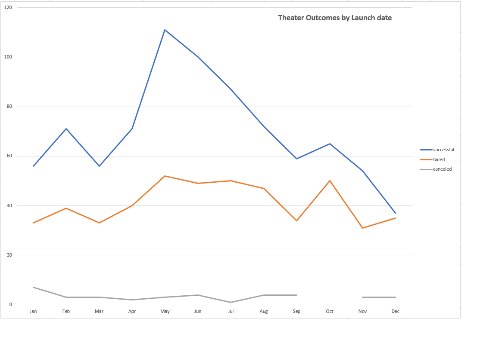
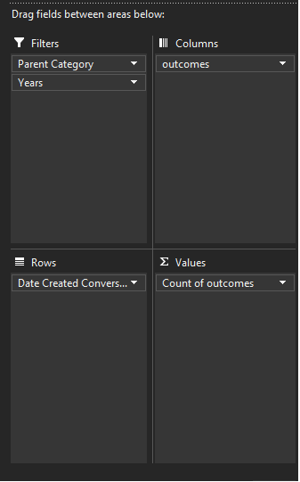
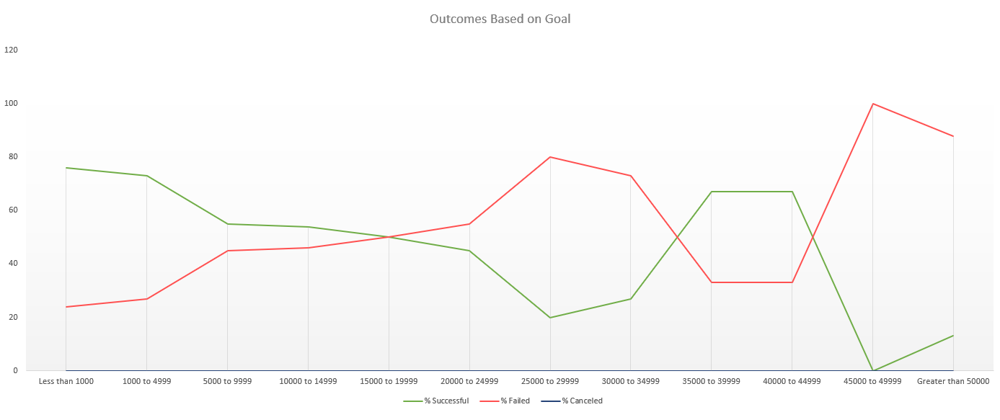

# Kickstarter Challange
## 1. Analysis of Campaign outcomes:
This analysis is to visualize how every campaign fared in relation to their launch dates and their funding goals. All the analysis is done on theater kickstarter campaigns as per client's request. Previously we gathered data on what type of kickstarter campaigns are most successful, how their success is tied to their funding goals and what time of the year is best to start a successful kickstarter. With all the data collected we managed to start a successful kickstarter. The following analysis show's how other campaings are proceeding. 
## 2. Analysis and Challenges
### Outcomes Based on Launch Date:

For this dataset i started with pivot tables. Filtered so that only theater data was showing. After filtering the data created a line graph and added a header. Changed my line graph design to make it cleaner and be more easy to undestand. I had some challanges figuring out the right way to sort data into the pivot table. After March 4th thursdays class i figure out.
 
### Outcomes Based on Goals:

For this dataset i followed the instrutions with no problem. After getting the initial "=COUNTIFS()" formula right, i just copied and pasted adjusting the goal size and column names. Same goes for the column that calculates %. After that i created a line chart, gave it a header. Adjust the colors on the graph to show successful line as Green and failed line as Red. I did not encounter any challange but i would assume the "=COUNTIFS()" formula could give people trouble as there were a lot of criteria to fill and get right.

## 3. Results
### Outcomes Based on Launch Date:
Two conclusion we can make from this data is that kickstarter campaigns launched at May, June and July had more success than campaigns launched at any other time of the year. And kickstarter campaigns launched at October and December had the most failure rate.   
 
### Outcomes Based on Goals:
Kickstarters campaigns with lower funding goals were more successful. Due to the limitation of this dataset, important to note around the funding goal between 35k to 45k the success rate is higher than the failure rate, which seems to contradicting our conclusion. While the data is true, we have to consider the number of total projects in that goal range is significantly less compared to the number of total projects in other goal ranges. Whcih is why this data does not influence the overall conclusion because it deviates from the mean.    
