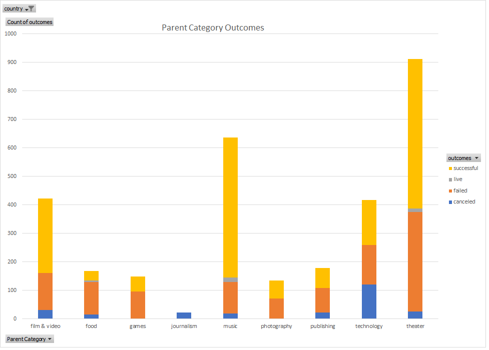
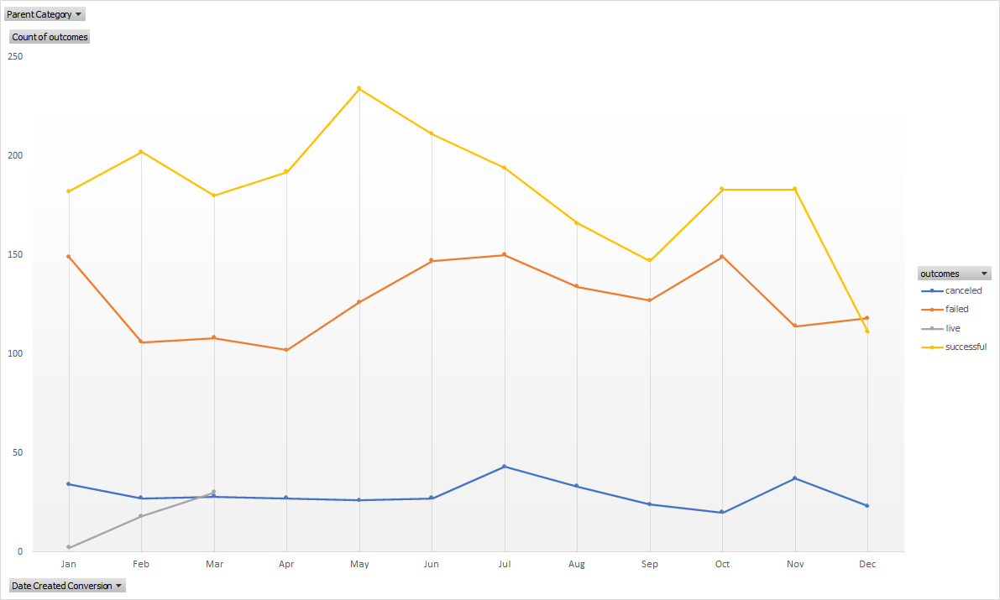

# Analysis of kickstarter Campaigns 
Stats into successful and failed kickstarters. Breaking down the catageory of kickstarters. 
Analysing funds (goals/pledge) to make the clients kickstarter successful. 
Graph showing what time of the year a kickstarter is most likely to succeed.  

